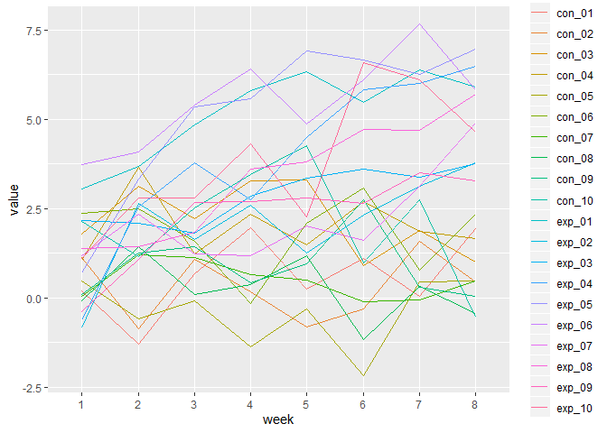
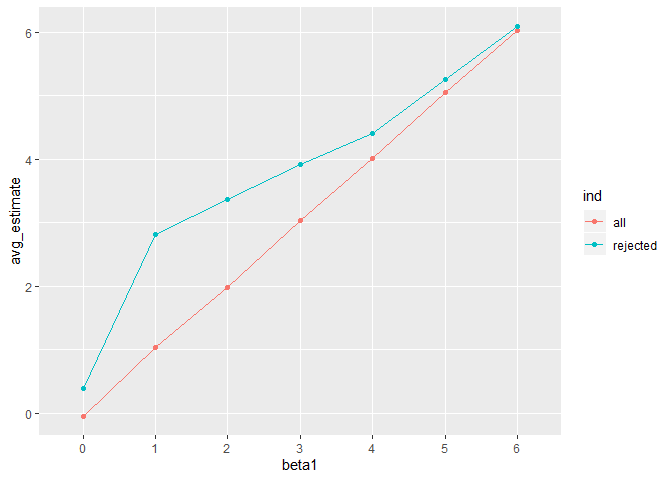

p8105\_hw5\_yj2581
================
YucongJiang
2019-11-3

Problem 1
---------

``` r
set.seed(10)

iris_with_missing = iris %>% 
  map_df(~replace(.x, sample(1:150, 20), NA)) %>%
  mutate(Species = as.character(Species))

filling = function(x){
  if (is.character(x)){
    x[which(is.na(x))] = "virginica"
  }
  else{
    x[which(is.na(x))] = round(mean(x[which(!is.na(x))]), digits = 1)
  }
  
  x
}

iris_filled = map_df(.x = iris_with_missing, ~ filling(.x))

iris_filled
```

    ## # A tibble: 150 x 5
    ##    Sepal.Length Sepal.Width Petal.Length Petal.Width Species
    ##           <dbl>       <dbl>        <dbl>       <dbl> <chr>  
    ##  1          5.1         3.5          1.4         0.2 setosa 
    ##  2          4.9         3            1.4         0.2 setosa 
    ##  3          4.7         3.2          1.3         0.2 setosa 
    ##  4          4.6         3.1          1.5         1.2 setosa 
    ##  5          5           3.6          1.4         0.2 setosa 
    ##  6          5.4         3.9          1.7         0.4 setosa 
    ##  7          5.8         3.4          1.4         0.3 setosa 
    ##  8          5           3.4          1.5         0.2 setosa 
    ##  9          4.4         2.9          1.4         0.2 setosa 
    ## 10          4.9         3.1          3.8         0.1 setosa 
    ## # ... with 140 more rows

#### Comment on the code

Problem 2
---------

``` r
filenames = list.files("data/")

read_csv_plus <- function(x){
  read_csv(paste("data/", x, sep = "")) %>%
  mutate(
    filename = str_sub(x, 1, 6),
    group = ifelse(str_detect(x, "con"), "control", "experiment"),
    ind = str_sub(x, 5, 6)
  )
}

batch_data <- map_df(.x = filenames, ~ read_csv_plus(.x)) %>%
  mutate(
    participant = factor(filename),
    group = factor(group, levels = c("control", "experiment"))
  ) %>%
  select(-filename)

batch_data
```

    ## # A tibble: 20 x 11
    ##    week_1 week_2 week_3 week_4 week_5 week_6 week_7 week_8 group ind  
    ##     <dbl>  <dbl>  <dbl>  <dbl>  <dbl>  <dbl>  <dbl>  <dbl> <fct> <chr>
    ##  1   0.2  -1.31    0.66   1.96   0.23   1.09   0.05   1.94 cont~ 01   
    ##  2   1.13 -0.88    1.07   0.17  -0.83  -0.31   1.58   0.44 cont~ 02   
    ##  3   1.77  3.11    2.22   3.26   3.31   0.89   1.88   1.01 cont~ 03   
    ##  4   1.04  3.66    1.22   2.33   1.47   2.7    1.87   1.66 cont~ 04   
    ##  5   0.47 -0.580  -0.09  -1.37  -0.32  -2.17   0.45   0.48 cont~ 05   
    ##  6   2.37  2.5     1.59  -0.16   2.08   3.07   0.78   2.35 cont~ 06   
    ##  7   0.03  1.21    1.13   0.64   0.49  -0.12  -0.07   0.46 cont~ 07   
    ##  8  -0.08  1.42    0.09   0.36   1.18  -1.16   0.33  -0.44 cont~ 08   
    ##  9   0.08  1.24    1.44   0.41   0.95   2.75   0.3    0.03 cont~ 09   
    ## 10   2.14  1.15    2.52   3.44   4.26   0.97   2.73  -0.53 cont~ 10   
    ## 11   3.05  3.67    4.84   5.8    6.33   5.46   6.38   5.91 expe~ 01   
    ## 12  -0.84  2.63    1.64   2.58   1.24   2.32   3.11   3.78 expe~ 02   
    ## 13   2.15  2.08    1.82   2.84   3.36   3.61   3.37   3.74 expe~ 03   
    ## 14  -0.62  2.54    3.78   2.73   4.49   5.82   6      6.49 expe~ 04   
    ## 15   0.7   3.33    5.34   5.57   6.9    6.66   6.24   6.95 expe~ 05   
    ## 16   3.73  4.08    5.4    6.41   4.87   6.09   7.66   5.83 expe~ 06   
    ## 17   1.18  2.35    1.23   1.17   2.02   1.61   3.13   4.88 expe~ 07   
    ## 18   1.37  1.43    1.84   3.6    3.8    4.72   4.68   5.7  expe~ 08   
    ## 19  -0.4   1.08    2.66   2.7    2.8    2.64   3.51   3.27 expe~ 09   
    ## 20   1.09  2.8     2.8    4.3    2.25   6.57   6.09   4.64 expe~ 10   
    ## # ... with 1 more variable: participant <fct>

``` r
batch_data %>% 
  pivot_longer(
    week_1:week_8,
    names_prefix = "week_",
    names_to = "week",
    values_to = "value"
  ) %>%
  ggplot(aes(x = week, y = value, group = participant, color = participant)) +
  geom_line()
```



#### Comment on the result

Problem 3
---------

``` r
set.seed(2581)

sim_regression <- function(n, beta0 = 2, beta1 = 0) {
  
  sim_data = tibble(
    x = rnorm(n, mean = 0, sd = 1),
    y = beta0 + beta1 * x + rnorm(n, 0, sqrt(50))
  )
  
  ls_fit = lm(y ~ x, data = sim_data)
  
  broom::tidy(ls_fit) %>%
    filter(term == "x") %>%
    select(estimate, p.value)
}

sim_result_0 <- rerun(1000, sim_regression(n = 30)) %>%
  bind_rows()

head(sim_result_0)
```

    ## # A tibble: 6 x 2
    ##   estimate p.value
    ##      <dbl>   <dbl>
    ## 1   2.17    0.0611
    ## 2   0.770   0.352 
    ## 3  -0.601   0.588 
    ## 4  -0.850   0.525 
    ## 5  -0.830   0.469 
    ## 6   0.0713  0.950

``` r
sim_result_all <- map_df(.x = 0:6, ~ rerun(1000, sim_regression(n = 30, beta1 = .x) %>%
                           mutate(beta1 = .x)) %>% bind_rows()
                         )

sim_result_all %>%
  mutate(
    reject = ifelse(p.value < 0.05, 1, 0)
  ) %>%
  group_by(beta1) %>%
  summarize(proportion = mean(reject)) %>%
  mutate(
    beta1 = factor(beta1)
  ) %>%
  ggplot(aes(x = beta1, y = proportion, fill = beta1)) +
  geom_histogram(stat = "identity")
```

    ## Warning: Ignoring unknown parameters: binwidth, bins, pad


``` r
sim_result_avg <- sim_result_all %>%
  group_by(beta1) %>%
  summarize(avg_estimate = mean(estimate)) %>%
  mutate(
    beta1 = factor(beta1),
    ind = "all"
  )

sim_rejected_avg <- sim_result_all %>%
  filter(p.value < 0.05) %>%
  group_by(beta1) %>%
  summarize(avg_estimate = mean(estimate)) %>%
  mutate(
    beta1 = factor(beta1),
    ind = "rejected"
  )

bind_rows(sim_result_avg, sim_rejected_avg) %>%
  ggplot(aes(x = beta1, y = avg_estimate, group = ind, color = ind)) +
  geom_point() + geom_line()
```


