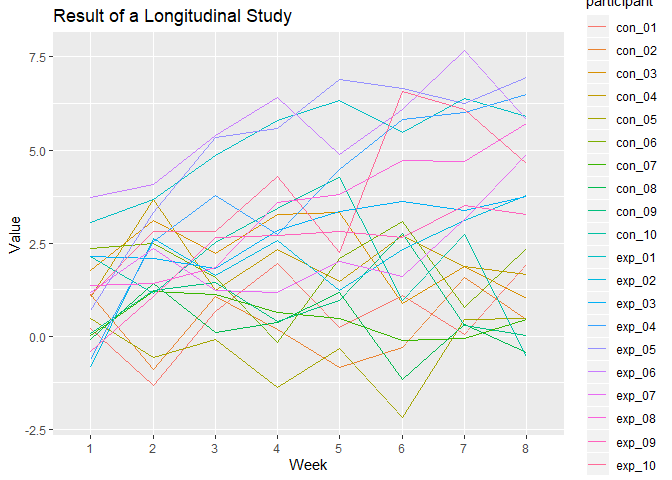
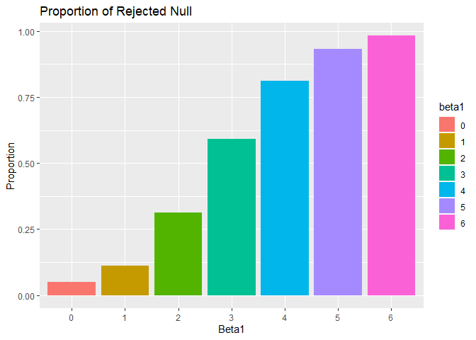
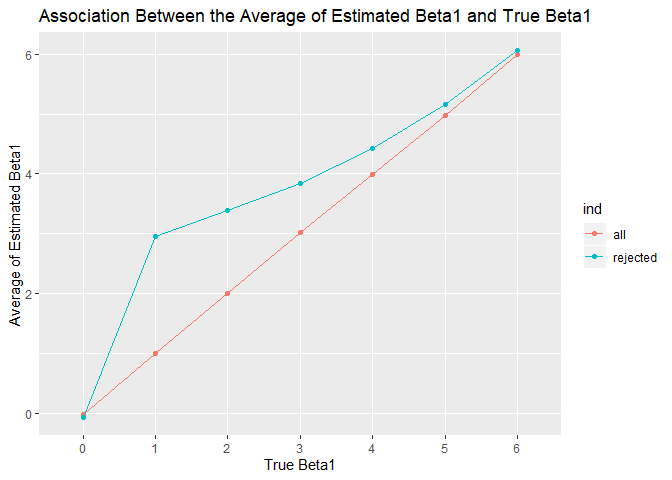

p8105\_hw5\_yj2581
================
YucongJiang
2019-11-3

Problem 1
---------

``` r
# set randomized seed for the following problems
set.seed(10)

iris_with_missing = iris %>% 
  map_df(~replace(.x, sample(1:150, 20), NA)) %>%
  mutate(Species = as.character(Species))

# the function replacing the missing value
filling = function(x){
  if (is.character(x)){
    x[which(is.na(x))] = "virginica"
  }
  else{
    x[which(is.na(x))] = round(mean(x[which(!is.na(x))]), digits = 1)
  }
  
  x
}

# apply the function
iris_filled = map_df(.x = iris_with_missing, ~ filling(.x))

head(iris_filled)
```

    ## # A tibble: 6 x 5
    ##   Sepal.Length Sepal.Width Petal.Length Petal.Width Species
    ##          <dbl>       <dbl>        <dbl>       <dbl> <chr>  
    ## 1          5.1         3.5          1.4         0.2 setosa 
    ## 2          4.9         3            1.4         0.2 setosa 
    ## 3          4.7         3.2          1.3         0.2 setosa 
    ## 4          4.6         3.1          1.5         1.2 setosa 
    ## 5          5           3.6          1.4         0.2 setosa 
    ## 6          5.4         3.9          1.7         0.4 setosa

Notice that I rounded the mean values to 1 digit, consistent to the original data.

Problem 2
---------

The zip file had been unzipped before, manually.

``` r
# Get the filenames
filenames = list.files("data/")

# Modify read_csv, add 3 variables based on the instruction
read_csv_plus <- function(x){
  read_csv(paste("data/", x, sep = "")) %>%
  mutate(
    filename = str_sub(x, 1, 6),
    group = ifelse(str_detect(x, "con"), "control", "experiment"),
    ind = str_sub(x, 5, 6)
  )
}

# Apply the function and factorize two variables
batch_data <- map_df(.x = filenames, ~ read_csv_plus(.x)) %>%
  mutate(
    participant = factor(filename),
    group = factor(group, levels = c("control", "experiment"))
  ) %>%
  select(-filename)

# Show the result
head(batch_data)
```

    ## # A tibble: 6 x 11
    ##   week_1 week_2 week_3 week_4 week_5 week_6 week_7 week_8 group ind  
    ##    <dbl>  <dbl>  <dbl>  <dbl>  <dbl>  <dbl>  <dbl>  <dbl> <fct> <chr>
    ## 1   0.2  -1.31    0.66   1.96   0.23   1.09   0.05   1.94 cont~ 01   
    ## 2   1.13 -0.88    1.07   0.17  -0.83  -0.31   1.58   0.44 cont~ 02   
    ## 3   1.77  3.11    2.22   3.26   3.31   0.89   1.88   1.01 cont~ 03   
    ## 4   1.04  3.66    1.22   2.33   1.47   2.7    1.87   1.66 cont~ 04   
    ## 5   0.47 -0.580  -0.09  -1.37  -0.32  -2.17   0.45   0.48 cont~ 05   
    ## 6   2.37  2.5     1.59  -0.16   2.08   3.07   0.78   2.35 cont~ 06   
    ## # ... with 1 more variable: participant <fct>

Three variables were added while reading: `participant` refers to the filenames (without .csv); `group` shows which arm the observation belongs to; `ind` is the index of participants.

``` r
# Create the plot
batch_data %>% 
  
  # Extract the week number
  pivot_longer(
    week_1:week_8,
    names_prefix = "week_",
    names_to = "week",
    values_to = "value"
  ) %>%
  
  # Color the line by participant, maybe by group is better
  ggplot(aes(x = week, y = value, group = participant, color = participant)) +
  geom_line() +
  labs(
    title = "Result of a Longitudinal Study",
    x = "Week",
    y = "Value"
  )
```



From above we know that:

-   At first, there is no significant difference between the experiment arm and control arm;
-   There is an ascending trend in experiment arm as time goes by, different from the control arm;
-   In Week 7 and 8, the minimum value in the experiment arm is larger than the maximum value in the control arm.

Problem 3
---------

#### Generating the datasets

Here I generated two results: one for beta1 = 0 only; one for beta1 = {0, 1, 2, 3, 4, 5, 6}.

``` r
# Simulation function, use broom::tidy to extract estimate value and p-value
sim_regression <- function(n, beta0 = 2, beta1 = 0) {
  
  sim_data = tibble(
    x = rnorm(n, mean = 0, sd = 1),
    y = beta0 + beta1 * x + rnorm(n, 0, sqrt(50))
  )
  
  ls_fit = lm(y ~ x, data = sim_data)
  
  broom::tidy(ls_fit) %>%
    filter(term == "x") %>%
    select(estimate, p.value)
}

# Generate the result for beta1 = 0, this code may take about some minutes
sim_result_0 <- rerun(10000, sim_regression(n = 30)) %>%
  bind_rows()

# Show the result
head(sim_result_0)
```

    ## # A tibble: 6 x 2
    ##   estimate  p.value
    ##      <dbl>    <dbl>
    ## 1    2.02  0.207   
    ## 2    1.23  0.182   
    ## 3    0.603 0.606   
    ## 4    3.03  0.000149
    ## 5   -1.19  0.471   
    ## 6   -1.49  0.219

``` r
# Generate the result for beta1 from 0 to 6, add a variable in the dataframe to indicate the true beta1
sim_result_all <- map_df(.x = 0:6, ~ rerun(10000, sim_regression(n = 30, beta1 = .x) %>%
                           mutate(beta1 = .x)) %>% bind_rows()
                         )

# Show the result
head(sim_result_all)
```

    ## # A tibble: 6 x 3
    ##   estimate p.value beta1
    ##      <dbl>   <dbl> <int>
    ## 1   -0.912  0.491      0
    ## 2    2.11   0.0665     0
    ## 3    0.813  0.473      0
    ## 4    2.03   0.113      0
    ## 5    1.06   0.307      0
    ## 6   -1.48   0.196      0

#### Make two plots based on the instruction

``` r
sim_result_all %>%
  mutate(
    
    # Mark whether the null is rejected
    reject = ifelse(p.value < 0.05, 1, 0)
  ) %>%
  group_by(beta1) %>%
  
  # Use mean to calculte the proportion
  summarize(proportion = mean(reject)) %>%
  mutate(
    
    # Factorize beta1 for plotting
    beta1 = factor(beta1)
  ) %>%
  
  # Use histogram plot
  ggplot(aes(x = beta1, y = proportion, fill = beta1)) +
  geom_histogram(stat = "identity") +
  labs(
    title = "Proportion of Rejected Null",
    x = "Beta1",
    y = "Proportion"
  )
```



Here we can see that the power increases as the effect size (beta1) goes awat from 0.

``` r
# Calculate the average for all
sim_result_avg <- sim_result_all %>%
  group_by(beta1) %>%
  summarize(avg_estimate = mean(estimate)) %>%
  mutate(
    beta1 = factor(beta1),
    ind = "all"
  )

# Calculate the average for rejected null
sim_rejected_avg <- sim_result_all %>%
  filter(p.value < 0.05) %>%
  group_by(beta1) %>%
  summarize(avg_estimate = mean(estimate)) %>%
  mutate(
    beta1 = factor(beta1),
    ind = "rejected"
  )

# Bind the above two and create the plot
bind_rows(sim_result_avg, sim_rejected_avg) %>%
  ggplot(aes(x = beta1, y = avg_estimate, group = ind, color = ind)) +
  geom_point() + geom_line() +
  labs(
    title = "Association Between the Average of Estimated Beta1 and True Beta1",
    x = "True Beta1",
    y = "Average of Estimated Beta1"
  )
```



Aross all tests, the average of estimated beta1 for all is approximately equal to the true value of beta1.

-   When beta1 = 0, the average of estimated beta1 for which the null is rejected is approximately equal to true value of beta1, since the distribution is symmetric with respect to 0;
-   When beta1 = 1, the average of estimated beta1 for which the null is rejected is larger than the true value, since it excludes those near-0 values (the null is accepted), compared with the average for all.
-   As the effect size (beta1) becomes larger, the proportion of which the null is accepted decreases rapidly and can no longer affect the average value. Therefore, the difference between the average of estimated beta1 for which the null is rejected and the true value goes down.
